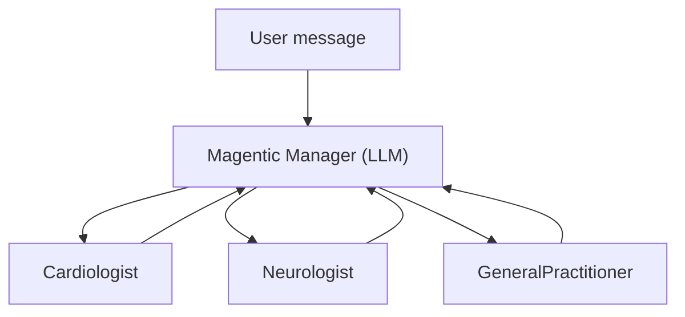

# 05 — Dynamic Orchestration

In the previous lesson you built a **deterministic** workflow where the
execution path was fixed at design time. In this lesson you will use
**dynamic orchestration** where an AI manager decides which specialist agents
to involve and in what order.

## Orchestration patterns at a glance

Agent Framework ships with several built-in orchestration builders:

| Pattern | Builder | Description |
|---------|---------|-------------|
| **Sequential** | `SequentialBuilder` | Chain agents one after another, shared context |
| **Concurrent** | `ConcurrentBuilder` | Fan-out to multiple agents in parallel, fan-in results |
| **Handoff** | `HandoffBuilder` | Triage agent routes to specialists; control returns to user |
| **Group Chat** | `GroupChatBuilder` | Multi-round discussion managed by a selector |
| **Magentic** | `MagenticBuilder` | AI manager plans and dynamically coordinates agents |

This lesson focuses on **Magentic** — the most dynamic pattern.

## How Magentic works



1. The **manager** receives the user message and creates a plan.
2. It assigns tasks to **participants** (specialist agents).
3. Each participant executes its task and returns a result.
4. The manager reviews results and may iterate or finalise.

The key difference from a fixed workflow: the manager **dynamically decides**
which agents to call and how many rounds of interaction are needed.

## The healthcare scenario

A patient presents with chest tightness, headaches, and arm numbness. The
Magentic manager coordinates a cardiologist, neurologist, and general
practitioner to assess the case.

## The code

File: [`examples/05-orchestration/magentic_orchestration.py`](https://github.com/beyondelastic/maf-workshop/blob/main/examples/05-orchestration/magentic_orchestration.py)

```python
import asyncio
import os

from dotenv import load_dotenv

from agent_framework import Agent
from agent_framework.foundry import FoundryChatClient
from agent_framework.orchestrations import MagenticBuilder
from azure.identity import AzureCliCredential

load_dotenv()


async def main() -> None:
    client = FoundryChatClient(
        project_endpoint=os.environ["FOUNDRY_PROJECT_ENDPOINT"],
        model=os.environ.get("FOUNDRY_MODEL", "gpt-5.4-mini"),
        credential=AzureCliCredential(),
    )

    # Specialist agents
    cardiologist = Agent(
        client=client,
        name="Cardiologist",
        instructions=(
            "You are a cardiologist. Provide analysis only for heart-related "
            "symptoms. If the case is not cardiac, say so briefly."
        ),
    )

    neurologist = Agent(
        client=client,
        name="Neurologist",
        instructions=(
            "You are a neurologist. Provide analysis only for neurological "
            "symptoms. If the case is not neurological, say so briefly."
        ),
    )

    general_practitioner = Agent(
        client=client,
        name="GeneralPractitioner",
        instructions=(
            "You are a general practitioner. Provide a holistic assessment "
            "and summarise recommendations from the specialists."
        ),
    )

    # Manager agent
    manager = Agent(
        client=client,
        name="Manager",
        instructions=(
            "You coordinate a team of medical specialists. "
            "Delegate tasks to the right specialist based on the patient's symptoms "
            "and synthesise their responses into a final assessment."
        ),
    )

    # Build the Magentic orchestration
    workflow = MagenticBuilder(
        participants=[cardiologist, neurologist, general_practitioner],
        manager_agent=manager,
        intermediate_outputs=True,
    ).build()

    # Run with streaming
    patient_case = (
        "A 55-year-old patient reports chest tightness, occasional headaches, "
        "and numbness in the left arm that started two weeks ago."
    )
    print(f"Patient case: {patient_case}\n")
    print("--- Orchestration output ---\n")

    current_agent = None
    async for event in workflow.run(patient_case, stream=True):
        if event.type == "output" and hasattr(event.data, "text") and event.data.text:
            name = getattr(event.data, "author_name", None)
            if name and name != current_agent:
                current_agent = name
                print(f"\n\n[{current_agent}]\n")
            print(event.data.text, end="", flush=True)
    print()


if __name__ == "__main__":
    asyncio.run(main())
```

## Step-by-step walkthrough

### 1. Create specialist agents

Each agent has a narrow role. The cardiologist only addresses cardiac symptoms,
the neurologist only neurological ones, and the GP provides a holistic summary.

### 2. Build with MagenticBuilder

```python
workflow = MagenticBuilder(
    participants=[cardiologist, neurologist, general_practitioner],
    manager_agent=manager,
    intermediate_outputs=True,
).build()
```

`MagenticBuilder` takes a list of `participants` and a `manager_agent` that
plans and coordinates them. You do not need to define edges or routing logic —
the manager handles it dynamically. Setting `intermediate_outputs=True` enables
streaming of each specialist's response as it is generated.

### 3. Stream the output

```python
current_agent = None
async for event in workflow.run(patient_case, stream=True):
    if event.type == "output" and hasattr(event.data, "text") and event.data.text:
        name = getattr(event.data, "author_name", None)
        if name and name != current_agent:
            current_agent = name
            print(f"\n\n[{current_agent}]\n")
        print(event.data.text, end="", flush=True)
```

Each streaming chunk carries an `author_name` attribute that identifies which
agent produced it. Tracking the current name lets you print a header whenever
the active agent changes, so you can see contributions from each specialist.
With `stream=True` and `intermediate_outputs=True`, tokens arrive as they are
generated rather than waiting for the entire orchestration to complete.

## When to use which pattern

| Scenario | Recommended pattern |
|----------|-------------------|
| Fixed pipeline (A → B → C) | `SequentialBuilder` or manual `Workflow` |
| Parallel independent tasks | `ConcurrentBuilder` |
| User-facing routing (triage → specialist) | `HandoffBuilder` |
| Multi-round discussion | `GroupChatBuilder` |
| AI-planned task delegation | `MagenticBuilder` |

## Try it

```bash
python examples/05-orchestration/magentic_orchestration.py
```

You should see the manager coordinate the specialists and produce a combined
assessment.

## Key takeaways

- **Orchestration builders** provide high-level patterns for multi-agent
  coordination.
- **MagenticBuilder** uses an AI manager to dynamically plan and delegate tasks.
- You add **participants** — the manager decides who to call and when.
- Streaming works with orchestrations just like with single agents.

## Official references

- [Orchestration samples](https://github.com/microsoft/agent-framework/tree/main/python/samples/03-workflows/orchestrations)
- [Workflows overview](https://learn.microsoft.com/en-us/agent-framework/workflows/)
- [Magentic sample](https://github.com/microsoft/agent-framework/blob/main/python/samples/03-workflows/orchestrations/magentic.py)
